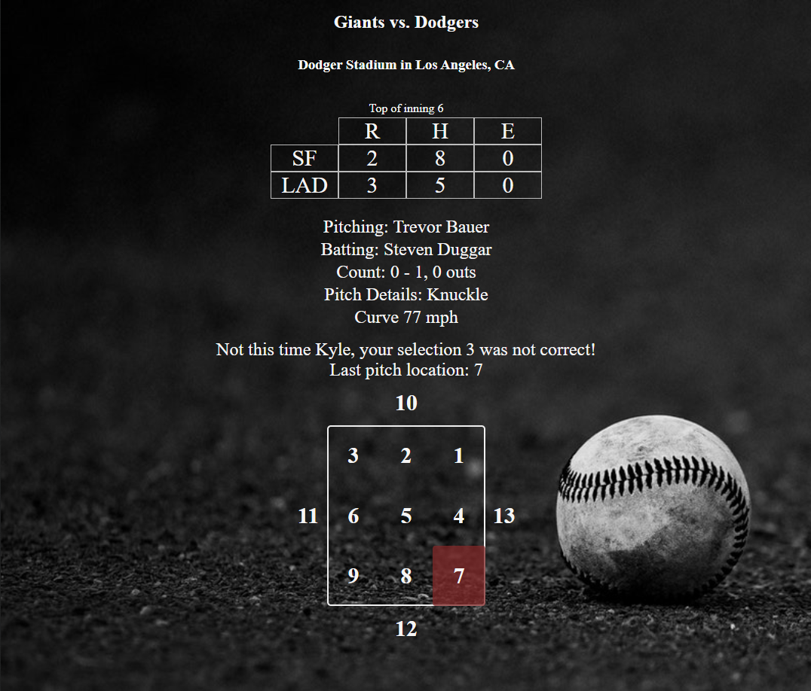

# Baseball Pitch Guesser

While enjoying your favorite baseball games, this app immerses you into the role of the pitcher on the mound.

You get to decide where the next pitch will go. Are you and the pitcher on the same page?

Fastballs high and in, or breaking pitches low and away for the hitter to chase?

[Live](https://baseball-pitch-guesser.herokuapp.com/) on Heroku

## How It's Made:

**Tech used:** HTML, CSS, JavaScript, Node, Express, MongoDB

With a Node backend to drive the experience, this app is then structured to use MongoDB for storing necessary data and mixes in a minor amount of client-side JavaScript. Utilizing the [SportRadar API](https://developer.sportradar.com/), this app receives and processes realtime pitch-by-pitch data and presents contextual information to the user. The user is placed into the shoes of the pitcher and submits a next pitch location guess. The server collects the next pitch data and presents how the close the user's guess was to the actual next pitch.

## Optimizations

Realtime statistic API calls have been reduced from initial implementation to stay under call limits. Game schedule API call happens when the first user navigates to the app on any given day and is stored for all users.

## Lessons Learned:

Taking on the challenge to build an app using play-by-play data and _gamifying_ the experience of watching a baseball game was a great opportunity. This project brought about a lot of lessons including but not limited to -- working with large JSON files, Express routing with custom API formation and controlling EJS rendering from user input. In the future, I feel this app is well suited to be transitioned into React. Stay tuned...

## TODOs:

- Requests for player (done!), team and ballpark images
- Requests for current player stats (match ups)
- Requests for current pitcher's pitch repertoire
- Reworking of UI, card approach (in progress)
- OVERHAUL to React/Node.js
- Progress API depth for in progress sessions -> fewer calls to limited realtime API
- Dynamic player card colors (by team)
- Handle unusual pitch type outcomes
- Handle better pitch-by-pitch controller with models

## Keep Exploring:

Take a look at these other examples that I have in my portfolio:

**Weather App (React):** https://github.com/kylemettling/weather-app

**"NunGram":** https://github.com/kylemettling/theNunGram

**Tic-Tac-Toe:** https://github.com/kylemettling/tic-tac-toe-js
